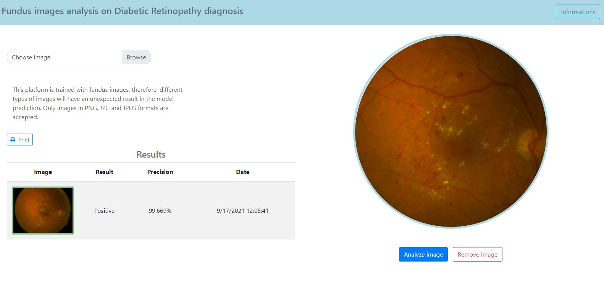

# retina-classifier
Final Software Engineering Bachelor's project, this project uses convolutional neural networks to Identify ​diabetic retinopathy. The application is a visual interpretation that uses the model to predict that the fundus images has some diabetic retinopathy symptom.
 

