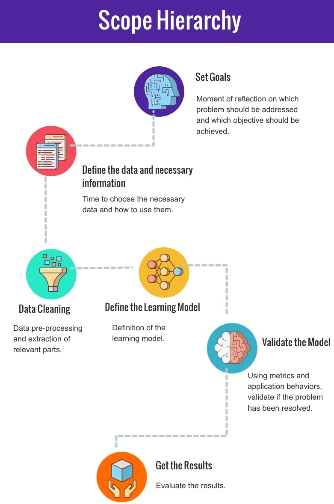
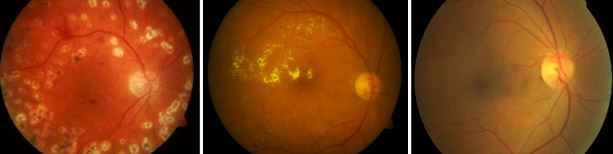
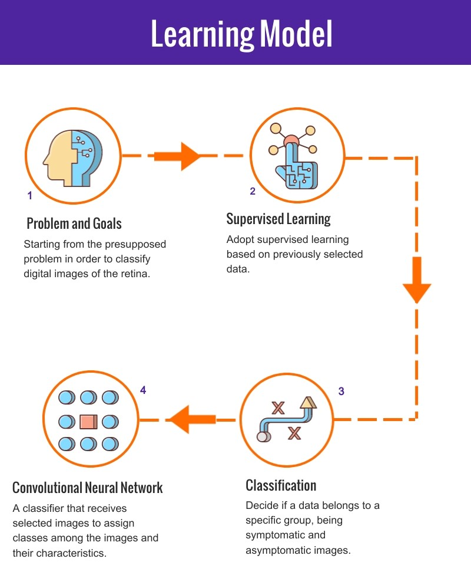
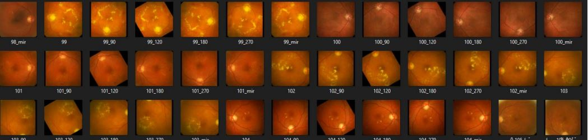
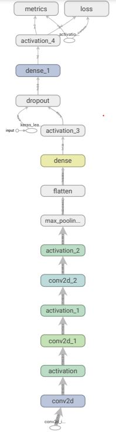
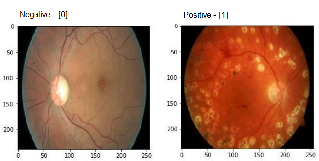

# Retina Classifier

## Motivation
When we talk about health systems, prevention is one of the most effective ways to avoid disease progression. In this way, most of them can be treated when diagnosed at an early stage. Thus, the need to preventive exams is a crucial factor, because many pathologies are identified in these moments. For this project, a CNN (Convolutional Neural Network) was developed to identify if the fundus image has some diabetic retinopathy symptom.  

Fundus images can provide relevant data about changes in eye diseases, and diabetic retinopathy is one of the main complications of Diabetes Mellitus (DM). At first, DR might cause no symptoms or only mild vision problems. But it can lead to blindness. Diabetes is an important and growing health problem across the planet, no matter your level. Prevention is the best way to avoid DR, unfortunately, diagnosis requires specific exams with adequate equipment and infrastructure to provide the exams properly. Therefore, there is a need to find a way to help and make the process faster, simple but  reliable.

## Objective

The question was how to use the digital fundus image processing associeated with Machine Learning to identify Diabetic Retinopathy and for that I had four main goals to follow:

* Examine the history, details and consequences of Diabetes Mellitus;
* Analyze the preponderant factors for the appearance of Diabetic Retinopathy;
* Look for tools with similar behavior that use image analysis;
* Implement an application for training and validating retinal images;

## Scope Hierarchy

* To define the idea, a scope was created to be followed. In this case, some important points adopted for a Machine learning project.

Initially, it was necessary to define the problem and carry out an evaluation of which problem would be solved and what would be the objective of the application. For this, the use of machine learning in digital image processing was applied. The data used were obtained from the public database <a href="https://www.it.lut.fi/project/imageret/diaretdb1/">DIARETDB1</a>;

The database consists of 89 colour fundus images of which 84 contain at least mild non-proliferative signs (Microaneurysms) of the diabetic retinopathy, and 5 are considered as normal which do not contain any signs of the diabetic retinopathy. 

## The Model
According to the needs of this project and its main characteristic, which is the image analysis, the model chosen was based on the inductive learning method. This form of learning uses preexisting examples, and in this case, the method used is supervised inductive learning. So, the type of model adopted was the CNN (Convolutional Neural Network).

## Preprocessing

To clean the initial set of data, several procedures were performed based on tests and trials. In the end, some methods were obtained, which are these:

1. Crop the original images;
2. Resize the data;
3. Mirror all images;
4. Rotate the images with symptoms;

### Crop and Resize the images

The original images were 1500x1152 pixels in size, which would be difficult for the hardware to process. Therefore, the Downscale process was used, which aims to reduce the size of the images. At the end of this step, the images were reduced to 256x256 pixels.

### Mirror the images

The next step was to mirror all the new images. This method can be very useful for generating new data for our dataset. Data Augmentation is an important technique that is used to help the model achieve better results.

### Rotate the Images With Symptoms;

Another step involving Data Augmentation was rotating the images that showed symptoms. After many tests, the images were rotated at four different angles: 90, 120, 180 and 270 degrees.

At the end of the process, the images were like this:

### Neural Network

To build the model, Keras was chosen because it can help us work with neural networks. The structure of the current model was built from many tests and adaptations according to the behavior of the results.

To predict two classes, the model use three convolutional layers and after that, a Max Pooling layer is applied. Next, the Flatten layer is used to reformulate the data. After executing the main structure, the dense layer is applied and for model output, another similar dense layer with 2 neurons is used.

At the end, an activation layer is applied using softmax. This function is responsible for returning a probabilistic value between two or more categories. The value returned by the function contains two positions that indicate the probability of each of these categories belongs to its defined classes.

### Results

For the prediction model, 89 original images were used, and after processing and data augmentation techniques, 722 images became available for training. Of these, about 20% were used for model validation. The results obtained after 25 epochs were 98% accurate and about 98% precision.

The model used has binary classification, the goal is decide wich class the new image can be classified. If has any DR symptom, the image is "Positive", otherwise, if the image is classified as healthy, so, it is "Negative".

After that, the model returns the following results:

<table>
	<thead>
		<th>Metrics</th>
		<th>Values</th>
	</thead>
	<tbody>
		<tr>
			<td>Accuracy</td>
			<td>98.62%</td>
		</tr>
		<tr>
			<td>Precision</td>
			<td>98.63%</td>
		</tr>
	</tbody>
</table>

## Predictions

The prediction can be classified in two types:

* Negative - [0];
* Positive - [1];

The model prediction can be visualized by the following application:

## Stack

